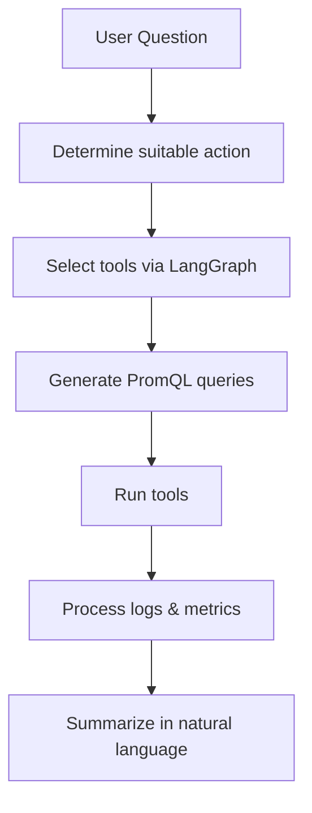

# SRE Agent API

## Overview
The SRE Agent API is a FastAPI application that allows users to ask Site Reliability Engineering (SRE) questions through a dedicated endpoint. It utilizes LangGraph and Llama-API to process and respond to these inquiries.

## Backend Pipeline

The backend follows a multi-step pipeline to transform a user question into actionable SRE insights. The high-level flow is:



1. **Question** – The user submits a question through the API or CLI.
2. **Determine suitable action** – The SRE agent analyzes the question to figure out what data is needed.
3. **Select tools (LangGraph)** – Using LangGraph, the agent chooses which monitoring tools or PromQL queries to use.
4. **Generate PromQL** – The agent formulates specific PromQL queries to retrieve metrics.
5. **Run tools** – Prometheus and other tools execute the queries and gather logs/metrics.
6. **Process logs and metrics** – Results are parsed and condensed into a technical summary.
7. **Summarize** – The LLM service provides a short natural language answer based on the technical findings.

## Project Structure
```
sre-agent-api
├── app
│   ├── __init__.py
│   ├── main.py
│   ├── agents
│   │   ├── __init__.py
│   │   └── sre_agent.py
│   ├── services
│   │   ├── __init__.py
│   │   └── llm_service.py
│   ├── models
│   │   ├── __init__.py
│   │   └── request_models.py
│   └── routes
│       ├── __init__.py
│       └── sre.py
├── tests
│   ├── __init__.py
│   ├── test_main.py
│   └── test_sre_agent.py
├── cli.py
├── pyproject.toml
├── .env.example
├── .gitignore
└── README.md
```

## Installation

This project uses [uv](https://github.com/astral-sh/uv) for fast Python package management.

### Prerequisites
- Python 3.12+
- uv (install with: `curl -LsSf https://astral.sh/uv/install.sh | sh`)

### Setup
To set up the project, clone the repository and install dependencies:

```bash
git clone <repository-url>
cd sre-agent-api
uv sync
```

## Usage

### FastAPI Server
To run the FastAPI application:

```bash
# Development mode (with auto-reload)
uv run uvicorn app.main:app --reload

# Production mode
uv run uvicorn app.main:app
```

This will start the server at `http://127.0.0.1:8000`.

### API Endpoints

#### Ask SRE Questions
Send a POST request to the `/sre/ask` endpoint:

```json
{
  "question": "What is the role of an SRE?"
}
```

#### Other Endpoints
- `POST /sre/incident-response` - Trigger incident response workflow
- `GET /sre/health` - Get system health report
- `GET /sre/tools/demo` - Run SRE tools demo
- `GET /sre/tools/health` - Check SRE tools health

### Command Line Interface

The CLI supports multiple commands for interacting with the SRE agent:

#### Using UV Scripts (Recommended)
```bash
# Ask a question
uv run cli -q "What is the current CPU usage?"

# Or using the alias
uv run sre-cli -q "What is the current CPU usage?"

# Get system health report
uv run cli --health

# Run SRE tools demo
uv run cli --demo

# Check tools health
uv run cli --tools-health

# Trigger incident response
uv run cli --incident "HighCPU" "critical"

# Use a different agent
uv run cli -a sre -q "Show me recent alerts"
```

#### Using Direct Python Command
```bash
# Ask a question
uv run python cli.py -q "What is the current CPU usage?"

# Get system health report
uv run python cli.py --health

# Run SRE tools demo
uv run python cli.py --demo

# Check tools health
uv run python cli.py --tools-health

# Trigger incident response
uv run python cli.py --incident "HighCPU" "critical"
```

### CLI Commands Reference

| Command | Description | Example |
|---------|-------------|---------|
| `-q, --question` | Ask a question to the SRE agent | `uv run cli -q "What is SRE?"` |
| `-a, --agent` | Specify agent type (default: sre_agent) | `uv run cli -a sre -q "hello"` |
| `--health` | Get comprehensive system health report | `uv run cli --health` |
| `--demo` | Run SRE tools demonstration | `uv run cli --demo` |
| `--tools-health` | Check health status of all SRE tools | `uv run cli --tools-health` |
| `--incident` | Trigger incident response workflow | `uv run cli --incident "AlertName" "severity"` |

## Development

### Running Tests
```bash
# Run all tests
uv run pytest

# Run specific test file
uv run pytest tests/test_sre_agent.py

# Run with verbose output
uv run pytest -v
```

### Adding Dependencies
```bash
# Add production dependency
uv add package-name

# Add development dependency
uv add --dev package-name
```

## Environment Variables
Create a `.env.local` file in the root directory based on the `.env.example` file:

```bash
# Copy example file
cp .env.example .env.local

# Edit with your actual API keys
LANGGRAPH_API_URL=your_langgraph_api_url_here
LANGGRAPH_API_KEY=your_langgraph_api_key_here
LLAMA_API_KEY=your_llama_api_key_here
```

## Contributing
Contributions are welcome! Please open an issue or submit a pull request for any enhancements or bug fixes.

## License
This project is licensed under the MIT License. See the LICENSE file for details.
